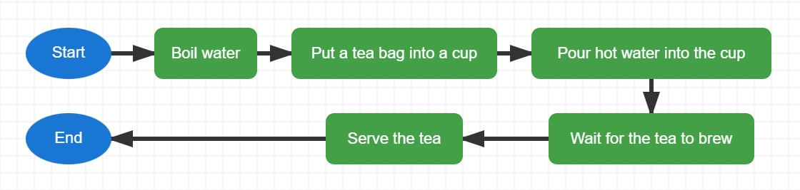

# Exercise 1 Answer — Making a Cup of Tea

## Suggested Answer

{width=inherit}

## Key Idea

This flowchart uses a simple **sequence**.

Each process happens one after another from **Start** to **End**.

### Symbols Used

- Start / End
- Process
- Arrow

### Move to next exercise -> [Click Me](ex2.md)
