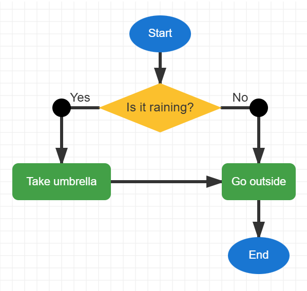

# Exercise 2 Answer — Is It Raining?

## Suggested Answer

{width=inherit}

## Key Idea

This flowchart introduces a **decision**.

The decision asks:

**Is it raining?**

- **Yes** → Take an umbrella
- **No** → Go outside

Both paths eventually reach **End**.

### Symbols Used

- Start / End
- Decision
- Process
- Arror

### Move to next exercise -> [Click Me](ex3.md)