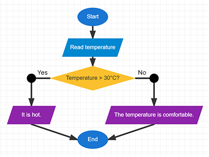

# Exercise 3 Answer — Temperature Checker

## Suggested Answer

{width=inherit}

## Key Idea

The program first receives an **input**.

It then checks whether the temperature is higher than **30°C**.

- **Yes** → Display "It is hot."
- **No** → Display "The temperature is comfortable."

### Symbols Used

- Start / End
- Input
- Decision
- Output
- Arrow

### Move to next exercise -> [Click Me](ex4.md)