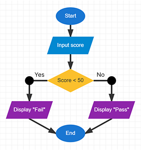

# Exercise 4 Answer — Pass or Fail

## Suggested Answer

{width=inherit}

## Key Idea

The program receives the student's score and checks:

**Is the score 50 or above?**

- **Yes** → Display "Pass"
- **No** → Display "Fail"

### Symbols Used

- Start / End
- Input
- Decision
- Output
- Arrow

## Challenge

For the challenge version, you can use more than one decision:

- **80 or above** → Excellent
- **50–79** → Pass
- **Below 50** → Fail

### Move to next exercise -> [Click Me](ex5.md)