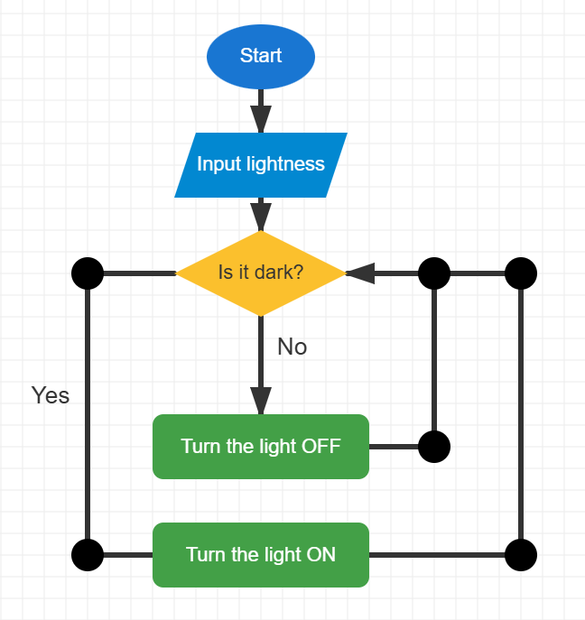

# Exercise 5 Answer — Smart Light System

## Suggested Answer

{width=inherit}

## Key Idea

The system reads the light sensor and checks:

**Is it dark?**

- **Yes** → Turn the light ON
- **No** → Turn the light OFF

After completing the action, the system checks the sensor again.

This creates a **loop**.

### Symbols Used

- Start / End
- Input
- Decision
- Process
- Arrow

## Challenge

The light should only turn ON when:

1. It is dark
2. A person is detected

This requires more than one decision in the flowchart.
