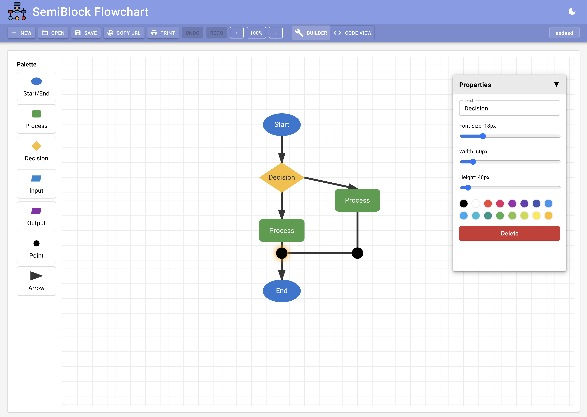

# Getting Started with Flowchart

The Flowchart editor provides a classic visual canvas for planning logic using standard flowchart symbols.

{width=100%}

## Accessing the Editor

Open the Flowchart tool from the SemiBlock main navigation or project area. It launches in **Builder** view with an empty or last-used canvas.

## Creating Your First Flowchart

1. Click **New** (or the SemiBlock Flowchart logo in the AppBar) to clear the canvas and start fresh.
2. Click the project name in the toolbar to rename it. The name is stored with the project.
3. Use the left **Palette** (7 tools):
   - **Start/End** — ellipse, typically used for entry and exit points.
   - **Process** — rounded rectangle for actions or computations.
   - **Decision** — diamond for yes/no branches.
   - **Input** — parallelogram for data coming in.
   - **Output** — parallelogram for data going out.
   - **Point** — small filled circle, useful as a junction or tap point (arrows to a Point have no arrowhead).
   - **Arrow** — connector tool (not a shape).
4. With a shape selected in the palette, click anywhere on the canvas to place it. Placement and subsequent drags **snap to a 20 px grid**.
5. To draw connections:
   - Select **Arrow** in the palette.
   - Click a white connection circle on the source shape (4 points for most shapes; 1 for Point).
   - Click a connection circle on the target shape.
   - A labeled line with arrowhead appears. Click the line later to edit its label.
6. Click any shape or arrow to select it. The right **Properties** panel (collapsible header) lets you edit:
   - **Text** label (also updates live on the canvas).
   - **Font Size** (10–48 px).
   - **Width** / **Height** (snapped to 20 px steps; sensible defaults per type: ellipses ~50×30, diamonds 40×40, parallelograms ~80×30, points 8×8).
   - **Color** — 16 swatches (applies to shape fill/stroke or arrow stroke + label).
   - **Arrow Text Offset** (only for arrows) — shifts the label horizontally along the line.
7. Drag shapes to move them; connected arrows follow automatically.
8. Keyboard: **Delete** removes the selected item (and any arrows attached to a deleted shape). **Escape** clears the selection.

## Toolbar Actions

- **New** — start over (clears local canvas).
- **Open** — shows a table of your saved projects (name + date). Click a row to load; use the trash icon to delete.
- **Save** — posts the current shapes/arrows + a PNG snapshot to the server under your account (`/project/save` with `type: 'flowchart'`).
- **Copy URL** — creates a shareable link. Opening the link in another browser/session prompts to copy the project into your workspace.
- **Print** — exports the current view as `flowchart.png` (background matches the active light/dark theme).
- **Undo / Redo** — full history stack (changes are also broadcast via a `flowchart-canvas-change` event).
- **Zoom** controls and the **Builder / Code View** toggle.

## Code View (JSON Round-Trip)

Switch to **Code View** to see the exact data model in a Monaco editor (dark/light aware):

```json
{
  "shapes": [
    { "type": "start", "x": 200, "y": 100, "label": "Start", "width": 50, "height": 30, "fontSize": 18, "color": "#333" },
    { "type": "process", "x": 200, "y": 200, "label": "Do something", "width": 120, "height": 40 }
  ],
  "arrows": [
    { "from": { "shapeIdx": 0, "pointIdx": 2 }, "to": { "shapeIdx": 1, "pointIdx": 0 }, "label": "begin", "fontSize": 14, "color": "#333", "textOffset": 0 }
  ]
}
```

- Edit the JSON freely.
- Click **Update Flowchart** to parse and push the model back to the visual canvas (auto-switches to Builder and remounts the component via a `resetKey`).

The model is also persisted automatically to `localStorage` under the keys `flowchart-canvas` and `flowchart-projectName`.

## Theme, Layout & Responsiveness

- Light/dark toggle in the top AppBar (persisted).
- The Properties panel is a fixed, collapsible Paper on the right.
- On iPad the layout uses slightly smaller dimensions.
- The canvas itself is an infinitely pannable/zoomable SVG (grid rendered to 3000 px in both axes).

## Tips & Best Practices

- Use **Point** shapes for complex merges or to create "wire taps" without arrowheads.
- Keep labels short; use the Properties font slider for emphasis on key steps.
- Save often — the server copy is what enables cross-device access and URL sharing.
- The editor is intentionally classic: it does not execute the flowchart. Pair it with Blockly or text code for runnable implementations.
- Exported PNGs are high-fidelity and suitable for reports or documentation.

## Technical Notes

The tool is a Vite + React 18 + TypeScript + MUI 5 + `@monaco-editor/react` application. Source lives in `newblock-server/flowchart/`. It is built with `base: '/flowchart-build/'` and output to the Laravel `public/flowchart-build` directory so it can be embedded directly in the SemiBlock web experience.

For the most up-to-date behavior, open the live editor inside your SemiBlock account and experiment with the Palette and Properties panel.