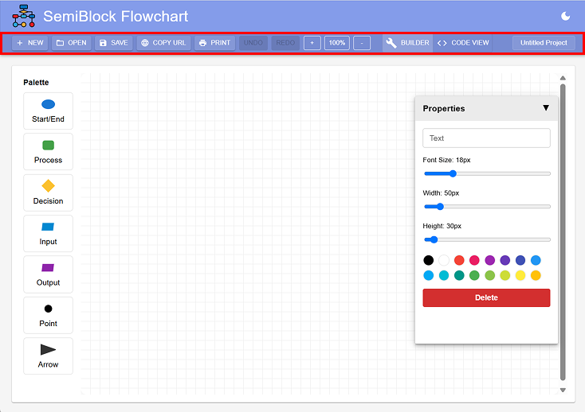
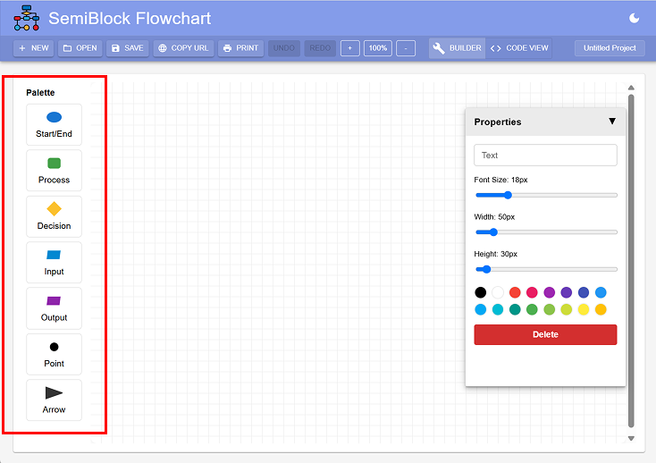
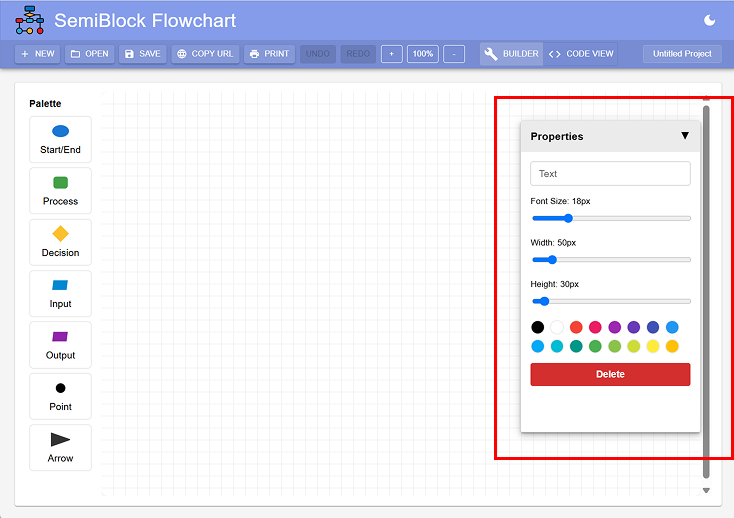

# Familiar with the Interface

Before creating your first flowchart, let's get familiar with the **SemiBlock Flowchart** interface.

The editor is divided into four main areas:

## 1. Toolbar

The **Toolbar** is located at the top of the editor. It contains the main controls for your flowchart project.

{width=inherit}

| Tool | Function |
| --- | --- |
| **New** | Create a new flowchart |
| **Open** | Open a saved project |
| **Save** | Save your current project |
| **Copy URL** | Create a link to share your flowchart |
| **Print** | Export your flowchart as an image |
| **Undo / Redo** | Undo or repeat your previous action |
| **Zoom + / -** | Zoom in or out of the canvas |
| **Builder** | Create and edit the flowchart visually |
| **Code View** | View or edit the flowchart using code |

---

## 2. Palette

The **Palette** is located on the left side of the workspace.

It contains the symbols you can use to build your flowchart.

{width=inherit}

- **Start/End** – Marks the beginning or end of a flowchart
- **Process** – Represents an action or instruction
- **Decision** – Represents a condition or question
- **Input** – Represents data entering the program
- **Output** – Represents information produced by the program
- **Point** – Creates a connection or junction
- **Arrow** – Connects different flowchart symbols

### Adding a Symbol

1. Select a symbol from the Palette.
2. Click on the canvas where you want to place it.
3. Use the **Properties Panel** to customise it.

---

## 3. Canvas

The large grid area in the centre is the **Canvas**.

This is where you build your flowchart.

You can:

- Add flowchart symbols
- Move symbols around
- Connect symbols using arrows
- Arrange the flowchart clearly
- Zoom in and out when working on larger flowcharts

> **Tip:** Arrange your flowchart from top to bottom or left to right so that it is easy to follow.

---

## 4. Properties Panel

The **Properties Panel** appears on the right side of the editor when an item is selected.

{width=inherit}

You can use it to customise the selected symbol or arrow.

You can change:

- **Text**
- **Font Size**
- **Width**
- **Height**
- **Colour**

You can also use **Delete** to remove the selected item.

---

## Builder and Code View

SemiBlock Flowchart provides two different ways to work with your project.

### Builder

The **Builder** is the visual editor.

You can create a flowchart by selecting symbols, placing them on the canvas and connecting them with arrows.

### Code View

The **Code View** allows you to see the structure of your flowchart as code.

This can help you understand how the visual flowchart is represented digitally.

---

## Quick Practice

Try creating a simple flowchart:

**Start → Input → Process → Output → End**

Once you are familiar with the interface, you are ready to create your first flowchart!

## 🎉 Time to Practice!

Now you have learned all the essential concepts. Let's get some hands-on experience! Open the SemiBlock Flowchart editor and follow our Getting Started tutorial to build your first diagram.