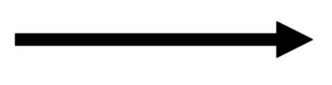

# What is a Flowchart?

A flowchart is a visual diagram that shows the steps of a process or program.
Instead of writing everything as sentences, a flowchart uses shapes, arrows, and symbols to show:

- What happens first
- What happens next
- Where decisions are made
- How a process ends
  
> Flowcharts are commonly used in programming, engineering, problem solving, and system design.

## Why Use a Flowchart?
Before writing a program, a flowchart can help you understand how the program should work.
It can help you:

- Organize your ideas
- Break a problem into smaller steps
- Understand the logic of a program
- Find mistakes before writing code
- Explain your idea to other people

For example, before programming a traffic light system, we can first create a flowchart showing when each light should turn on.

## Common Flowchart Symbols

| Image | Symbol | Name | Purpose |
| --- | --- | --- | --- |
| {height=100} | Oval | Start / End | Shows where the process begins or ends |
| {height=100} | Rectangle | Process | Shows an action or instruction |
| {height=100} | Diamond | Decision | Shows a question or condition |
| {height=100} {height=100} | Parallelogram | Input / Output | Shows information entering or leaving the system |
| {height=100} | Arrow | Flow Line | Shows the direction of the process |

